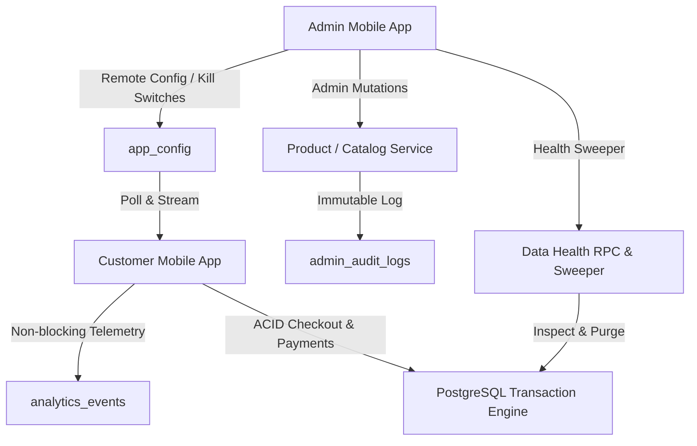

# Phase 8: Post-Launch Operations, Observability & Continuous Improvement Runbook

## 1. System Overview & Post-Launch Architecture

The B-Buys Grocery Platform is operated as a decoupled two-application system with a shared Supabase/PostgreSQL backend:
1. **Customer Mobile Application (`com.rast.opem`)**: Consumer catalog browsing, cart upsert, checkout, online payment verification, and order tracking.
2. **Admin Mobile Application (`com.rast.opem.admin`)**: Catalog management, category hierarchy, live order fulfillment, customer support console, SRE data health checks, immutable audit trail, and remote configuration toggles.
3. **PostgreSQL / Supabase Backend**:
   - Authoritative ACID transaction engine (orders, order items, stock reservations, idempotency, payments, and refunds).
   - Non-blocking `analytics_events` partition-ready telemetry table.
   - Immutable `admin_audit_logs` table.
   - Dynamic `app_config` table for remote feature flags and emergency kill switches.

---

## 2. Business Funnel & Product Telemetry

### A. Tracked Funnel Events
Only high-value, actionable business events are tracked. Pixel scrolling, micro-taps, and UI repaints are strictly excluded to avoid database bloat and client overhead:
1. `app_opened`
2. `product_viewed`
3. `cart_item_added`
4. `cart_item_removed`
5. `checkout_started`
6. `payment_started`
7. `order_created`
8. `search_performed`

### B. Decoupled Non-Blocking Architecture
> [!IMPORTANT]
> **Safety Guarantee**: Analytics failures will **never** block or abort customer browsing, cart modifications, or checkout operations. All telemetry calls are asynchronously buffered in-memory, executed via `Future.microtask`, and wrapped in complete exception suppression. Financial truth is strictly derived from the PostgreSQL ledger (`orders`, `payments`), never from analytics events.

### C. Automated Data Retention & Archival
- **Financial & Order Records**: Retained permanently in `orders`, `order_items`, `payments`, and `refunds`.
- **Analytics Telemetry**: Purged via bounded batch RPC `rpc_cleanup_expired_telemetry(p_days_retention := 90, p_batch_limit := 5000)`. Deletes in batches of 5,000 to eliminate lock contention on production tables.

---

## 3. Remote Configuration & Emergency Kill Switches

Server-controlled configuration (`app_config`) permits operations to adjust behavior dynamically without waiting for Google Play store review:

| Key | Description | Safe Default | Emergency Operation |
|---|---|---|---|
| `kill_switches.disable_checkout` | Emergency kill switch for checkout | `false` | Set to `true` during database maintenance or stock corruption incidents. |
| `kill_switches.disable_payments` | Emergency kill switch for gateway | `false` | Set to `true` during Razorpay gateway outages. |
| `kill_switches.disable_refunds` | Emergency refund pause | `false` | Set to `true` during financial reconciliation audits. |
| `maintenance_mode` | Global maintenance gate | `false` | When enabled, renders friendly notice to customers; admin stays open. |
| `min_supported_version` | Minimum SemVer gate | `1.0.0` | Forces older vulnerable mobile clients to update. |
| `feature_flags.deals_banner` | Promotional banner toggle | `true` | Hides deals carousel dynamically. |
| `feature_flags.recommendations`| Recommendation feed toggle | `true` | Disables recommendations if catalog service is degraded. |

---

## 4. SRE Data Health & Automated Reconciliation

### A. Daily Integrity Inspection RPC (`rpc_run_data_health_check()`)
Automated inspector running against production database:
1. **Negative Stock Check**: Detects any product record where `stock_quantity < 0`.
2. **Invalid Pricing Check**: Detects products with `price <= 0`.
3. **Stuck Reservations Check**: Detects reservations in `reserved` state past `now() - INTERVAL '15 minutes'`.
4. **Orphaned Order Items**: Detects line items missing a parent order record.
5. **Orphaned Payments**: Detects payment records referencing non-existent orders.
6. **Unresolved Payments**: Detects payments stuck in `pending` for > 2 hours.
7. **Catalog Completeness**: Detects active products with missing categories or image URLs.

### B. Bounded Reservation Expiration Sweeper
- Triggered on demand via `AdminHealthScreen` or automatically by cron every 10 minutes via `rpc_expire_reservations()`.
- Unlocks reserved stock and transitions status to `expired`, preventing stranded inventory.

---

## 5. Rules-Based Fraud & Abuse Monitoring Layer

Heuristic-based anomaly detection alerts operators without automated punitive account bans:
- **`REPEATED_PAYMENT_FAILURE`**: Triggered when a customer experiences $\ge 3$ consecutive payment failures. Action: Inspect gateway response codes and assist customer before restricting checkout.
- **`ABNORMAL_ORDER_VELOCITY`**: Triggered when $\ge 4$ orders are placed within 15 minutes by the same profile. Action: Inspect delivery addresses and confirm payment verification against bot activity.
- **`HIGH_REFUND_RATIO`**: Triggered when refunds exceed 30% of total order volume. Action: Inspect transit damages or policy exploitation.

---

## 6. Immutable Admin Audit Logging

All administrative mutations are recorded in `admin_audit_logs`:
- **Captured Attributes**: `actor_id`, `actor_email`, `action`, `entity_type`, `entity_id`, `previous_state`, `new_state`, `reason`, `severity`, `request_id`, `created_at`.
- **Enforced Immutability**: Row Level Security (RLS) denies all `UPDATE` and `DELETE` queries on `admin_audit_logs`.
- **Tracked Operations**: Price updates, inventory stock adjustments, product activations/deactivations, catalog deletions, feature flag adjustments, emergency kill switch toggles, and customer support refunds.

---

## 7. Disaster Recovery & Incident Response Protocols

### Incident Severity Levels
- **SEV-1 (Critical Outage)**: Checkout or payment gateway down, database unreachable. Response time: < 15 minutes.
- **SEV-2 (Degraded)**: Slow queries (P95 > 2000ms), partial image delivery failures, reservation sweeper lag. Response time: < 1 hour.
- **SEV-3 (Minor)**: Minor telemetry drop, single product display error. Response time: < 24 hours.

### Standard Post-Incident Report Template
1. **Incident Summary**: What occurred and overall business impact.
2. **Detection & Response Timeline**: Timestamp of alert trigger, acknowledgment, mitigation, and resolution.
3. **Root Cause Analysis (5 Whys)**: Underlying failure mechanism.
4. **Corrective & Preventative Actions**: Database index addition, regression test created, or circuit breaker tuned.
5. **Regression Test Mandate**: Every production bug must produce an automated regression test in `test/` preventing recurrence.

---

## 8. Staged Scaling Roadmap

| Stage | Milestones & Criteria | Architecture |
|---|---|---|
| **Stage 1 (Current)** | Up to 5,000 DAU, 150 req/sec | Single PostgreSQL Supabase instance, connection pooling, GIN Trigram indexes, non-blocking telemetry buffer, and in-memory client caching. |
| **Stage 2** | 5,000 – 50,000 DAU | Read replicas for admin analytics queries, CDN caching for image storage, Redis/Memcached layer for global product catalog caching. |
| **Stage 3** | 50,000 – 250,000 DAU | Kafka / Event streaming for telemetry and audit ingestion, asynchronous background workers for order delivery orchestration. |
| **Stage 4** | > 250,000 DAU | Table partitioning on `orders` and `analytics_events` by month, dedicated Elasticsearch / Meilisearch cluster for complex natural language search. |
